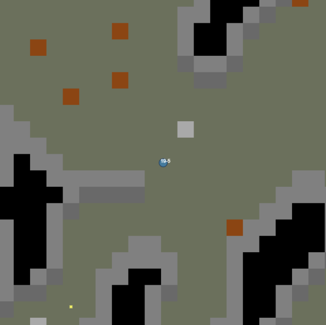

# my-procedural-content-generation

A basic test for procedural content generation based on this [video tutorial]().

The example provides:
- basic collision system
- camera management
- grid optimisation (render only tiles in camera)